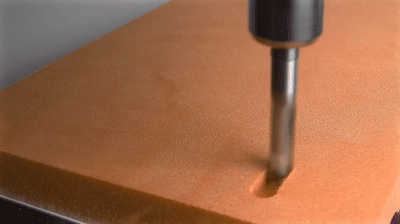
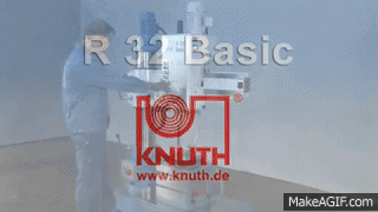
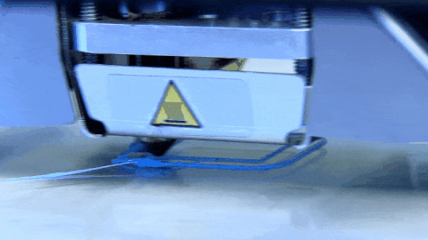
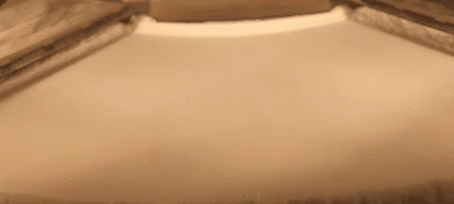

## Principles

The principles of 3DP, what to expect and what 3DP is not or not yet.

### Fabrication

#### Additive vs Subtractive



#### Computer Numerical Control

#### Safety

* Tecniques
  * Fused Deposition Modeling (FDM) 
  * Stereolithography (SLA) 
  * Selective Laser Sintering (SLS) 
  * Continuous Liquid Interface Production (CLIP) 
* FDM Materials
  * PLA
  * ABS
  * PETG
  * PTU
  * Nylon
  * Infused
* Printer parts
  * Cartesian & Delta
  * Direct drive & Bowden extruder
  * Hot end
    * Nozzle
    * Heat break
  * Print bed
* Slicer
  * Gcode sneak peak
  * Printer settings
    * Firmware
    * Bed size & print height
    * Nozzle size
  * Filament settings
    * Filament diameter
    * Nozzle & bed temperature
  * Print settings
    * Layer
      * Thickness
      * Perimeters & Surfaces
    * Infill percentage & pattern
    * Print, wall, infill & travel speed
    * Skirt, brim & raft
    * Supports
    * Retraction distance & speed
    * Vase mode
* Fusion 360
  * Sketching
    * Shapes
    * Constraints
  * Modelling
    * Extrude & Revolve
    * Fillet & Chamfer

### Links

 * https://all3dp.com/guides/
 * https://www.thingiverse.com/